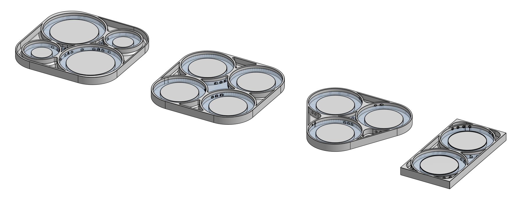

# Aphid_Tracking

A 3D-printed behavioral circular arena was developed as a novel, simple, fast, and cost-effective tool for observing the locomotor behavior of the freely walking wingless pea aphid *Acyrthosiphon pisum.* This innovative arena, combined with free-source machine learning-based tracking, provides a powerful method for tracking and identifying small insects like aphids in ways that were not previously technically possible.

--------------

## **The need for a proper arena**

Keeping animals in the tracking area without escaping or hiding is challenging. Thus, a key aspect remains proper arenas for recording and analyzing behavior. In preliminary trials, Petri dishes presented several challenges including, but not limited to, the aphids struggled to walk smoothly on their surface and they could hide on the walls; Escape increased without a controlled barrier or lid; Using adjacent transparent dishes complicated behavioral tracking due to issues with background adjustments, shadows, and reflections.

Our custom-designed 3D-printed arena effectively addressed these limitations. It enhanced tracking accuracy and eliminated visual interference between multiple arenas. Behavioral arenas were surrounded by water barriers in width and depth that prevented aphids from escaping or dropping into the water.The water level was maintained at the same level as the arena surface, ensuring there were no walls to hide. Additionally, the arenas can be easily 3D printed and produced at a low cost. 

 

Snapshots from a recorded video included 8 behavioral arenas. 

------------------

## **Printing overview**

[3D-parts](https://github.com/Sayedbaz/Aphid_Tracking/tree/main/3D_printed_parts " target=_blank") with different designs are available for download from the following [link](https://github.com/Sayedbaz/Aphid_Tracking/tree/main/3D_printed_parts).  We also provide a file containing the optimal parameters and setting for high quality printing.  

For different arena sizes, An CAD file is included in [onshape](https://cad.onshape.com/documents/ca48d507c3fd7c9ce7248830/w/1ea42ce5460d0e61e3c79328/e/212a23a2a2e88e1fc001638d?renderMode=0&uiState=673f0b836b5b324331d632c9), in which the diameter of the arena can be adjusted (*X*-Variable) and exported for 3D printing. 

Regarding materials, you have some options ([material guides](https://support.ultimaker.com/s/materials/ultimaker-285mm)), we listed below optimal ones for our behavioral arenas.

| **Material Name**                        | **Vendor/Link**                          | **Notes**                                |
| ---------------------------------------- | ---------------------------------------- | ---------------------------------------- |
| Ultimaker CPE (co-polyester)             | RS Components, [134-8181](https://benl.rs-online.com/web/p/3d-printing-materials/134-8181) | [How to print CPE](https://support.ultimaker.com/s/article/1667337602543) |
| Ultimaker CPE+ (co-polyester+)           | RS Components, [159-6350](https://benl.rs-online.com/web/p/3d-printing-materials/1596350) | [How to print CPE+](https://support.ultimaker.com/s/article/1667411013763) |
| Ultimaker PC (polycarbonate)             | RS Components, [159-6353](https://benl.rs-online.com/web/p/3d-printing-materials/1596353/) | [How to print PC](https://support.ultimaker.com/s/article/1667337602519) |
| Ultimaker ABS (acrylonitrile butadiene styrene) | RS Components, [134-8171](https://benl.rs-online.com/web/p/3d-printing-materials/1348171) | [How to print ABS](https://support.ultimaker.com/s/article/1667337602935) |

For our prints, an Ultimaker S5 printer was used. No support is needed while printing. The 3D arena should be printed with very solid, tough, and [chemical-resistant materials](https://ultimaker.com/learn/chemical-resistant-materials-a-beginners-guide) to ensure it can be easily cleaned. The suggested materials achieve the best surface quality without risking damaging their texture over time. 

**Note**: *We do not recommend using PLA or Tough PLA filament. Items printed with PLA may lose their properties and become brittle over time. Additionally, both filaments may deform at temperatures exceeding 50°C.*

The number of arenas that can be printed and viewed in a single recording depends on the experimental design, as well as the camera's focal length and height. In all cases, the accuracy of the tracking primarily relies on the quality of the video recordings; tracked individuals should not be blurred or out of focus. 

--------------

## **Tracking**

Recent advances in artificial intelligence and machine learning provide tools that can measure the locomotor behavior of various model organisms, ranging from small insects to vertebrates. Among these tools is open-source [idtracker.ai](https://idtracker.ai/latest/), which provides a way to track and identify multiple individuals in a group at very high resolution.  

Here are examples of tracked aphids.

https://github.com/user-attachments/assets/09f2a27d-1118-4d59-aaa9-f76e0f732501

-------------

Interestingly, as a defense mechanism and survival strategy, aphids may display post-dropping tonic immobility (TI) or a thanatosis phenomenon in which they feigned death. Likewise, after being transferred into the behavioral arena, the aphids showed a period of TI before walking. 

https://github.com/user-attachments/assets/bed94495-8360-40e9-9b54-ba1a5930d2c0

------

For an overview of the implications in the behavioral arena to investigate the physiological and behavioral adaptations of aphids in response to changing conditions, please see our paper:

 El-Sayed Baz, Cissy Huygens, Federica Calevro and  Patrick Callaerts at [Journal](under_review  ) (under review).

-------------------------------------------------

